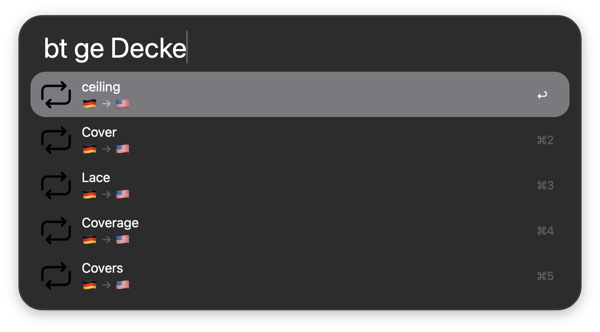

# WordWeave

Fast translation in [Alfred](https://www.alfredapp.com/), offline with a lean implementation of [Argos](https://github.com/argosopentech/argos-translate/) or online with Google Translate: one keyword for each, use either or both. See a ranked list of candidate translations for every input & use **ping-pong** translation to quickly close in on exactly the word you are looking for: translate a word, press Tab, translate the result back, repeat. A word in one language often maps to several in another, so bouncing back and forth works like a cross-language thesaurus. Great for finding the word on the tip of your tongue.



## Features

- **Ranked results**: see several candidate translations in Alfred's result list, with a user-configurable parameter to dial in how many results you are shown.
- **Every language pair is a first-class citizen**: no "default" pair or language must (or can!) be specified - polyglots welcome!
- **Customizable QuickCode system**: define short handles for your most-used languages, or specify language pairs via their ISO 639-1 codes.
- **Customizable emoji per language**: don't feel like the U.S. flag should represent the English language? Me neither! Specify exactly which flag should represent which language, or forgo national flags entirely. The world is your oyster! 🏳️‍🌈
- **Two translators, two keywords**: `bt` translates with Argos, entirely offline once its models are downloaded, and your text never leaves your Mac. `btg` translates with Google Translate: no downloads, more languages, better on longer text, but it needs internet and sends your text to Google. Use one or both; clear a keyword in the workflow settings to switch it off (clear `btg` and WordWeave stays fully offline. Yay!)
- **Private by default**: nothing is sent anywhere unless you type the Googly keyword 👀.
- **Fast**: tuned for Alfred's run-on-every-keystroke model. Translations take on the order of 100 ms with Argos Lean (the default); Google depends on your connection.

## Requirements

- macOS with [Alfred](https://www.alfredapp.com/) and the Powerpack
- Python 3.14 + the [`uv` package manager](https://astral.sh/uv) (NOTE: this workflow pulls dependencies from pypi on first run - inspect `pyproject.toml` to see exactly what is downloaded)

## Installation

1. Download the latest `.alfredworkflow` from the [Releases](../../releases) page.
2. Double-click it to import into Alfred.
3. On first run, the workflow installs its dependencies. For Google (`btg`), that's all you need. For Argos (`bt`), models are fetched from the upstream Argos package index on demand and are not bundled in this repository; see the documentation inside the workflow, or "Usage" below, to learn how to download them.

## Usage

WordWeave has one keyword per translator. Both work exactly the same way, and you can rename or switch off any of them in the workflow settings:

| Default keyword | Translator | Needs internet | Needs model download |
| --- | --- | --- | --- |
| `bt` | Argos | No (after downloading models) | Yes, per language pair |
| `btg` | Google Translate | Yes | No |
| `btd` | (downloads Argos models) | Yes | n/a |

In the examples below, `[keyword]` stands for `bt` or `btg`.

| Command | What it does |
| --- | --- |
| `[keyword] .dees <text>` | Prepend a dot to specify the language pair via their ISO 639 codes. |
| `[keyword] gs <text>` | Don't prepend with a dot to specify the language pair via the customizable QuickCode language map. |
| `btd english german` | Search the Argos model repository for the English → German model and install it (Argos only). |

Press `tab` to quickly reverse-translate:

`[keyword] .deen Hausboot` → *tab* → `[keyword] .ende House boat`

Tab keeps you on the same keyword, so a ping-pong started with `btg` stays on Google.

## Known limitations

**Argos (`bt`)**

- Quality and language coverage depend on the available models, and they are weaker than Google Translate, especially on longer texts. Models are one-way and need one download per direction. If you need better quality, use `btg`.

**Google (`btg`)**

- Needs an internet connection, and everything you type after the keyword is sent to Google. WordWeave is not affiliated with Google.
- Each keystroke triggers one request, so heavy use can get rate-limited. It relies on the unofficial `googletrans` package and web endpoint, which may break at any time.
- Alternatives are listed for single words only; a phrase gets one translation.
- Supports around 120 languages (two-letter ISO codes only).

## Development

```bash
git clone https://github.com/paraversal/WordWeave.git
# create symlink to the local repo in the Alfred workflow folder. Any changes in the local repo folder are mirrored to Alfred
ln -s WordWeave/src ~/Library/Application\ Support/Alfred/Alfred.alfredpreferences/workflows/user.workflow.WordWeave
```

## Contributing

Issues and pull requests are welcome. 

## License

WordWeave is free software, licensed under the [GNU General Public License v3.0](LICENSE).

## Acknowledgements

- powered by [Argos](https://github.com/argosopentech/argos-translate) and [ctranslate2](https://github.com/OpenNMT/CTranslate2) for the offline translator, and [googletrans](https://github.com/ssut/py-googletrans) for the Google keyword
- workflow icon by Jagat Icon (via Flaticon) 