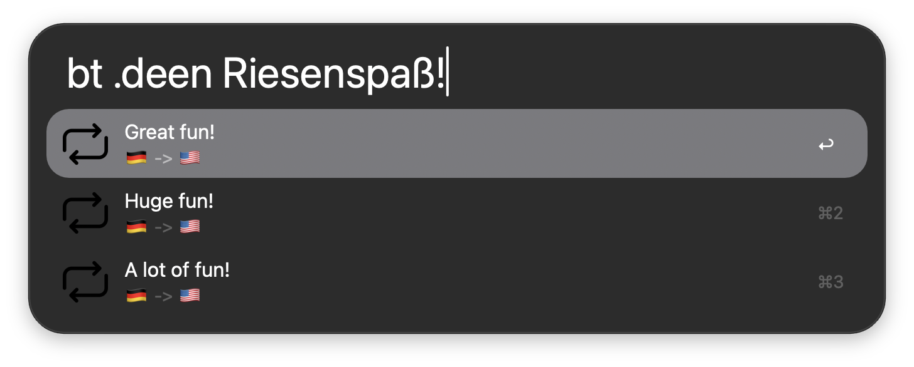

# WordWeave

Fast offline translation in [Alfred](https://www.alfredapp.com/) using a lean implementation of [Argos](github.com/argosopentech/argos-translate/). It offers a ranked list of candidate translations and is built for **ping-pong**: translate a word, press Tab, translate the result back, repeat. A word in one language often maps to several in another, so bouncing back and forth works like a cross-language thesaurus. Great for finding the word on the tip of your tongue. Which Great fun!



## Features

- **Ranked results**: see several candidate translations in Alfred's result list, with a user-configurable parameter to dial in how many you results you are shown.
- **Every language pair is a first-class citizen**: no "default" pair or language must (or can!) be specified - polyglots welcome!
- **Customizable QuickCode system**: define short handles for your most-used languages, or specify language pairs via their ISO 639-1 codes.
- **Customizable emoji per language**: don't feel like the U.S. flag should represent the English language? Me neither! Specify exactly which flag should represent which language, or forgo national flags entirely. The world is your oyster! 🏳️‍🌈
- **Completely offline**: after initial model download, no internet connection is necessary for translation.
- **Fast**: tuned for Alfred's run-on-every-keystroke model - translations only take on the order of 100ms.

## Requirements

- macOS with [Alfred](https://www.alfredapp.com/) and the Powerpack
- Python + the [`uv` package manager](https://astral.sh/uv)

## Installation

1. Download the latest `.alfredworkflow` from the [Releases](../../releases) page.
2. Double-click it to import into Alfred.
3. On first run, the workflow installs its dependencies and downloads the common offline language packs.

## Usage

| Keyword | What it does |
| --- | --- |
| `[keyword] <text>` | Translate `<text>` using your default language pair |
| `[keyword] .dees <text>` | Prepend a dot to specify the language pair via their ISO 639 codes. |
| `[keyword] gs <text>` | Don't prepend with a dot to specify the language pair via the customizable QuickCode language map|

Press `tab` to quickly reverse-translate:

`[keyword] .deen Hausboot` → *tab* → `[keyword] .ende House boat`

## Offline language packs

Argos translation pairs can be installed on demand using the download keyword. 

Model data is fetched from the upstream Argos package index at install time; it is not bundled in this repository.

## Known limitations

- Offline quality and language coverage depend on the Argos models available for each pair. Don't expect the same quality of translations as you would get from Google Translate et al.

## Development

```bash
git clone https://github.com/paraversal/WordWeave.git
# create symlink to the local repo in the Alfred workflow folder. Any changes in the local repo folder are mirrored to Alfred
ln -s WordWeave ~/Library/Application\ Support/Alfred/Alfred.alfredpreferences/workflows/user.workflow.WordWeave
```

## Contributing

Issues and pull requests are welcome. 

## License

WordWeave is free software, licensed under the [GNU General Public License v3.0](LICENSE).

## Acknowledgements

- powered by [Argos](https://github.com/argosopentech/argos-translate) and [ctranslate2](https://github.com/OpenNMT/CTranslate2)
- workflow icon by Jagat Icon (via Flaticon) 